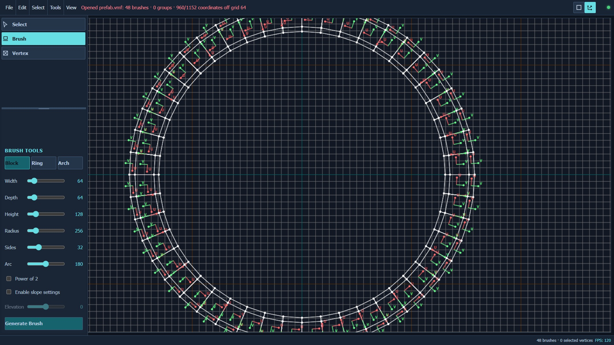

# Hammer Prefab Tool

Hammer Prefab Tool is a local browser editor for refining Source Engine brush prefabs before using them in Hammer or Hammer++.

Import ordinary VMF brush geometry, adjust it with Hammer-style grid and selection controls, validate the result, and export a clean VMF. The tool also includes block, ring, and arch generators for creating geometry to refine.



> [!IMPORTANT]
> This is an early, experimental project. It complements Hammer; it does not replace Hammer or provide a complete map-editing workflow.

## Features

- Import and export ordinary convex VMF brushes
- Preserve Hammer groups and loaded texture axes
- Generate blocks, rings, and arches
- Edit in Hammer-compatible top, front, and side orthographic views
- Select and move individual brushes, Hammer groups, or vertices
- Use Hammer-style grids, snapping, keyboard nudging, and selection modifiers
- Select inner or outer ring vertices and change ring radii
- Inspect texture U/V axes and align textures toward the center or outer edge
- Validate generated and transformed solids before export
- Undo and redo geometry and selection changes

## Requirements

- Windows 10 or newer
- [Node.js](https://nodejs.org/) 20.19 or newer
- Hammer or Hammer++ for complete maps, materials, entities, compiling, and testing

## Quick Start

Clone the repository and install its dependencies:

```bat
git clone https://github.com/Bucky420/hammer-prefab-tool.git
cd hammer-prefab-tool
npm install
```

Start the production server:

```bat
npm start
```

You can use `start.bat` instead on Windows. Open [http://localhost:8787](http://localhost:8787) if the browser does not open automatically.

For development with Vite hot reload, run:

```bat
npm run dev
```

You can use `dev.bat` instead on Windows. Do not run production and development modes at the same time.

## Basic Workflow

1. Open a VMF from the **File** menu, or choose **Brush** mode to generate a block, ring, or arch.
2. Switch between `TOP / XY`, `FRONT / YZ`, and `SIDE / XZ` by clicking the view label.
3. Select and move brushes, groups, or vertices in the viewport.
4. Use the **Tools** menu to snap vertices, set ring radii, inspect alignment, or validate geometry.
5. Export the result as a VMF and open or import it in Hammer.

## Selection Controls

- Drag empty space to create a selection box.
- Hold `Shift` to add to the selection.
- Hold `Alt` to remove from the selection.
- Hold `Ctrl` to toggle selection.
- Press `Delete` to remove selected geometry.
- Press `Ctrl+Z` or `Ctrl+Y` to undo or redo, including selection changes.
- Use the Object/Group toolbar toggle to switch selection scope.

## Configuration

The server reads `config.json` for its port and allowed project, import, export, and backup directories. Paths are restricted to those configured roots.

The default application URL is `http://localhost:8787`.

## Limitations

The editor currently focuses on ordinary convex brush geometry. Face and edge editing, entities and I/O, displacements, full material workflows, paths, advanced transforms, roads, stairs, tunnels, beveling, carving, compiling, and lighting remain Hammer responsibilities or future work.

Always validate exported geometry and test it in Hammer before using it in a production map.

## Contributing

Bug reports, test results, and focused pull requests are welcome. Keep exported geometry as valid convex Source brushes, and do not present planned controls as completed features.

## License

No license has been added. The repository is all rights reserved by default.
