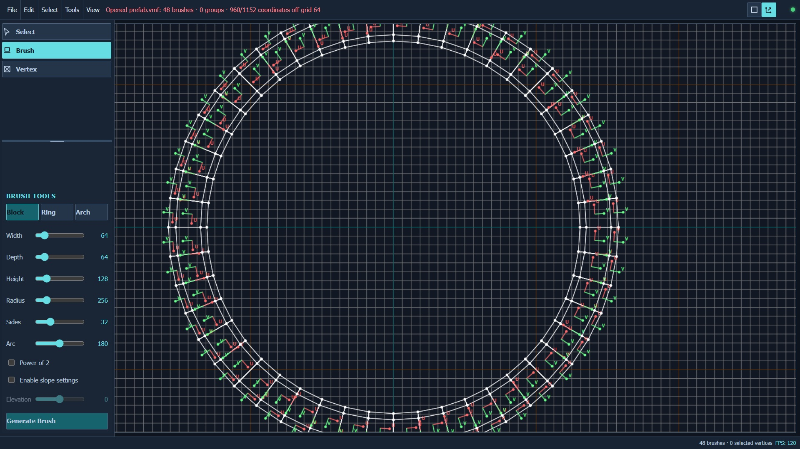
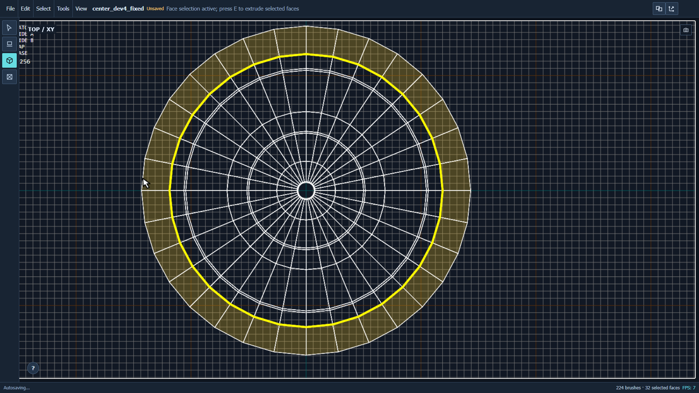
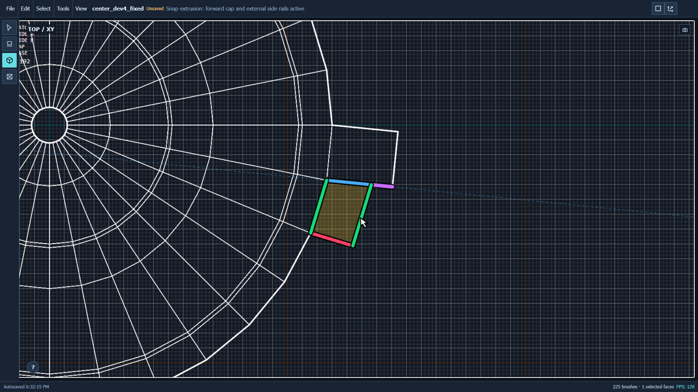
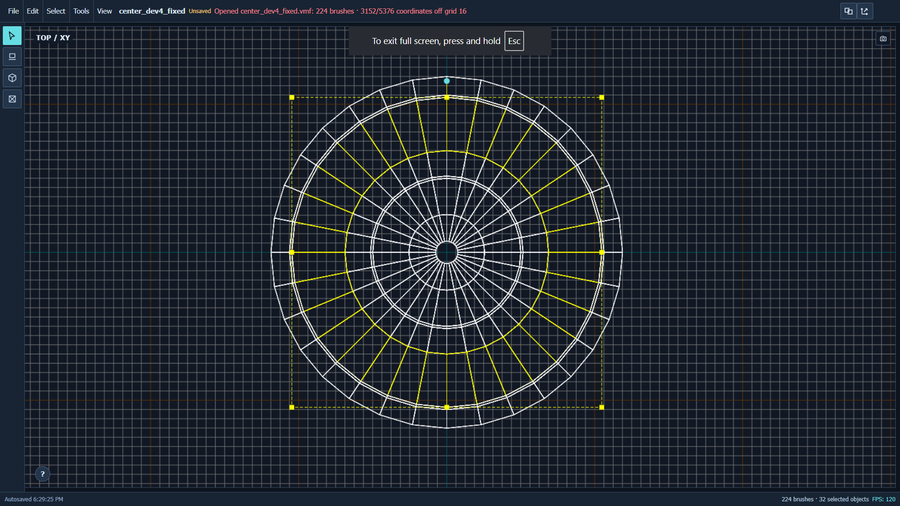
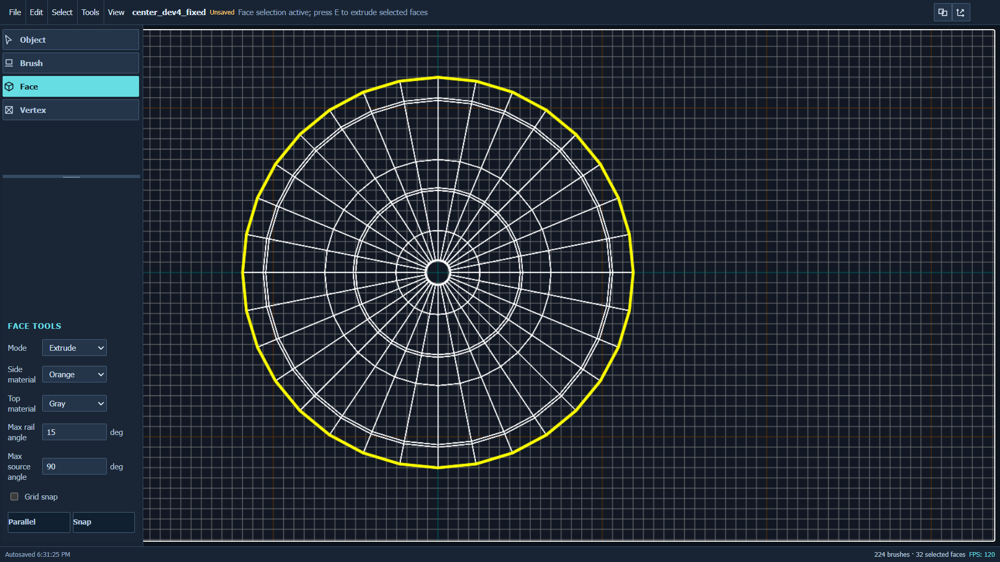
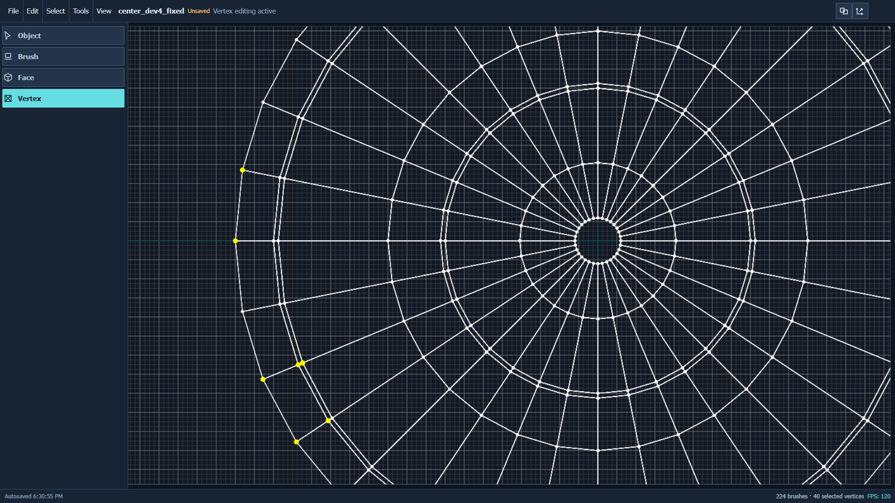
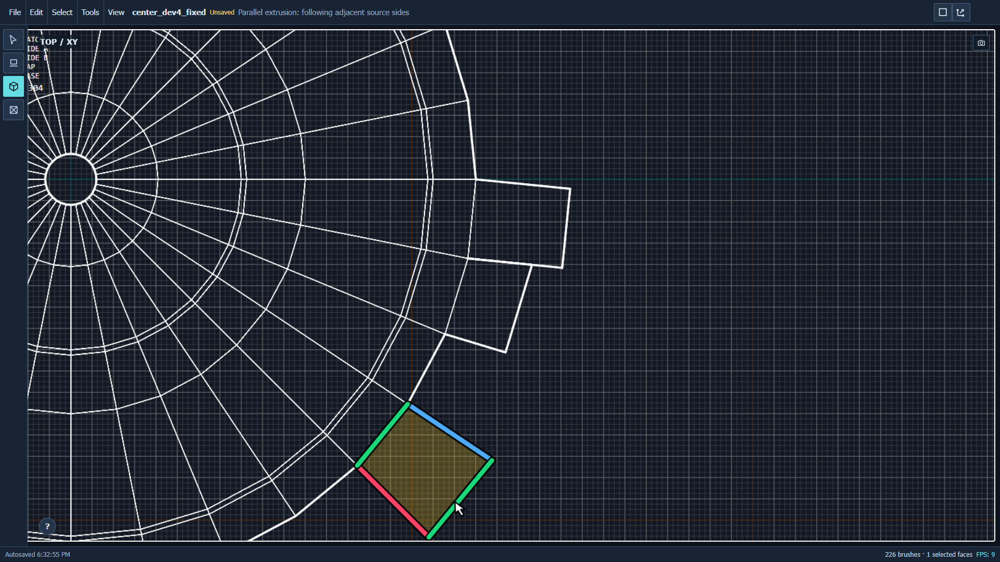
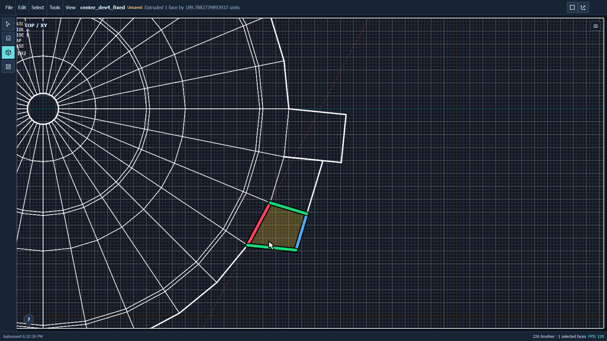

# Hammer Prefab Tool

An experimental browser tool for creating and refining Source Engine brush geometry before moving it into Hammer or Hammer++.

## [Open Hammer Prefab Tool →](https://bucky420.github.io/hammer-prefab-tool/)

No installation is required. VMF files are processed locally in your browser and are not uploaded.
Opening or refreshing the editor loads the latest deployed version. An already-open tab continues running its current version until it is refreshed.



> [!IMPORTANT]
> This is an early tool with basic editing features. It complements Hammer; it is not a complete map editor.

## Screenshots

Click any thumbnail for a larger view.

[](screenshots/image.png)
[](screenshots/aasdasd.png)
[](screenshots/asdasd.png)
[](screenshots/asdasdasd.png)
[](screenshots/asdasdasdadsasd.png)
[](screenshots/asdasdasdasd.png)
[](screenshots/asdasdasdasdasd.png)
[](screenshots/asdadasdasdasdasd.png)

## What works now

- Open and save convex VMF brush geometry.
- Select and move brushes, groups, faces, and vertices.
- Hammer-style grid snapping, nudging, undo, and redo.
- Face extrusion, including grouped connected-brush extrusion.
- Basic block, arch, cylinder, sphere, torus, and ring generation.
- Simple texture-axis and semantic ring-material tools.
- VMF saving, browser autosave recovery, and VMF validation.

The grouped extrusion system is currently the most developed part of the editor. Other tools are still basic and may have rough edges.

## Basic workflow

1. Open the [hosted editor](https://bucky420.github.io/hammer-prefab-tool/).
2. Drag in a `.vmf`, or use **File > Open VMF**.
3. Edit or generate brush geometry.
4. Save the Hammer-compatible VMF.
5. Open the VMF in Hammer or Hammer++ and compile/test it there.

## Saving

- **Save** writes the linked VMF directly when browser support allows it.
- **Save As** chooses and links a new VMF. Other browsers download the VMF instead.
- Tool-created prefabs include Hammer's prefab marker. Prefab settings control group ownership and optional shared floor or ceiling backing.
- Opening complete-map VMFs is experimental. They preserve supported map data and require **Save As** so the original is not overwritten automatically.
- Browser autosaves are internal recovery snapshots and are not separate project files.

Always keep important work in a saved VMF. Autosave is not a permanent backup.

## Local development

Node.js 20.19 or newer is only required for development, tests, builds, or optional local-server storage.

```bat
git clone https://github.com/Bucky420/hammer-prefab-tool.git
cd hammer-prefab-tool
npm install
npm run dev
```

Useful commands:

```bat
npm run build
npm run preview
npm test
npm run start:local
```

`npm run build` creates the static `dist/` site used for GitHub Pages.

## Limitations

- Only ordinary closed, convex Source brushes are directly supported.
- This is not a full entity, displacement, lighting, VIS, or compile workflow.
- Preserved VMF data may not be editable in the UI.
- Some editing and export paths are still experimental.

Inspect exported geometry in Hammer and compile/test it before using it in a real map.

## License

Licensed under the [Zero-Clause BSD License](LICENSE).
